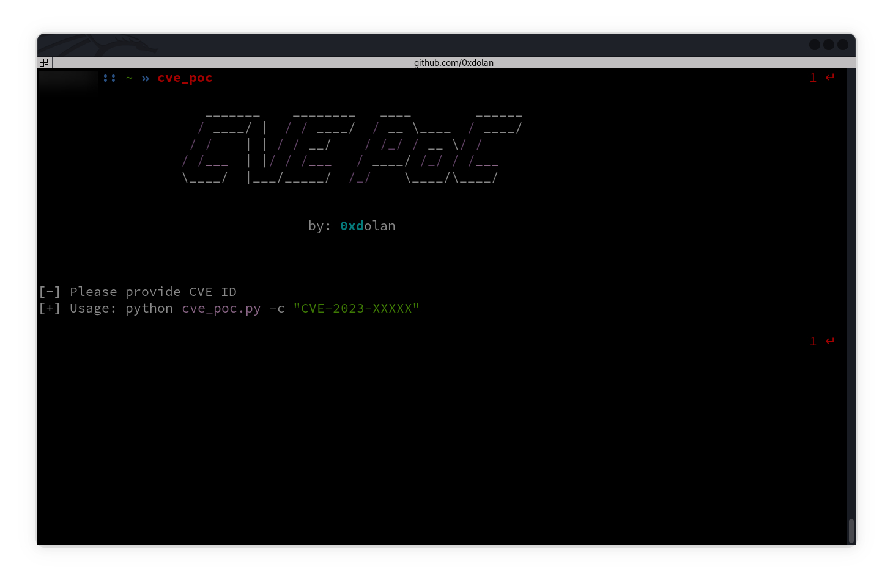
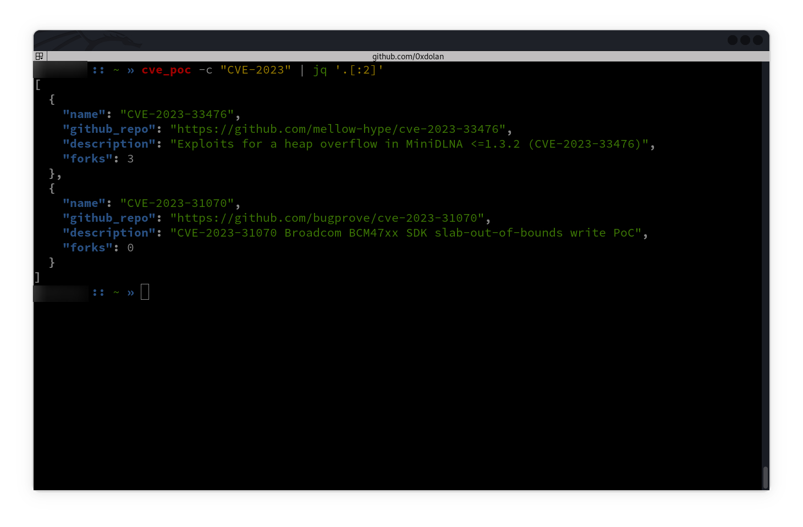
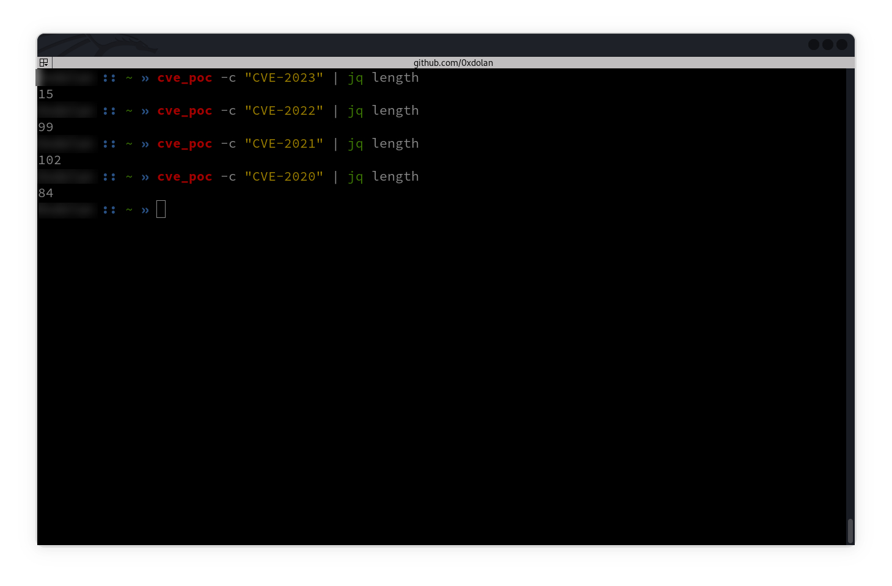

# CVE PoC

PoC for CVE ID using [**PoC-in-GitHub**](https://github.com/nomi-sec/PoC-in-GitHub) repo

<pre align="center"><code>

   ______ _    __    ______           ____           ______
  / ____/| |  / /   / ____/          / __ \  ____   / ____/
 / /     | | / /   / __/            / /_/ / / __ \ / /     
/ /___   | |/ /   / /___           / ____/ / /_/ // /___   
\____/   |___/   /_____/          /_/      \____/ \____/   
                                                           
</pre></code>

<p align="center">
  <a href="#how-it-works">How</a> •
  <a href="#install">Install</a>
  </p>
<br><br>

## How it works

[](./img/001.jpg)

[](./img/002.jpg)

[](./img/003.jpg)

## Install

1. Install the requirements:

   ```bash
   pip install -r requirements.txt

   # or use pip3

   pip3 install -r requirements.txt

   # or

   python3 -m pip install -r requirements.txt
   ```

2. Open terminal and run `cve_poc.py` file as follows:

   If you want to get all CVEs for 2023:

   ```bash
   python cve_poc.py -c "CVE-2023"
   ```

   or search for an exact one:

   ```bash
   python cve_poc.py -c "CVE-2023-1671"
   ```

   If you want to save it as json:

   ```bash
   python cve_poc.py -c "CVE-2023-1671" -o cve.json
   ```

   If you wanted to update the data from base repo [_PoC-in-GitHub_](https://github.com/nomi-sec/PoC-in-GitHub), you can run below command:

   ```bash
   python cve_poc.py -up
   ```

## License

Licensed under the GPLv3 License.
